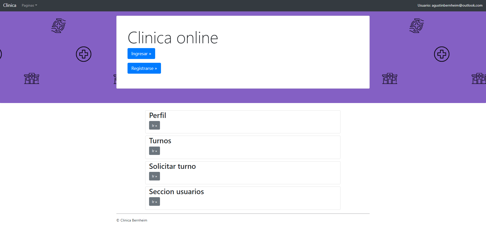
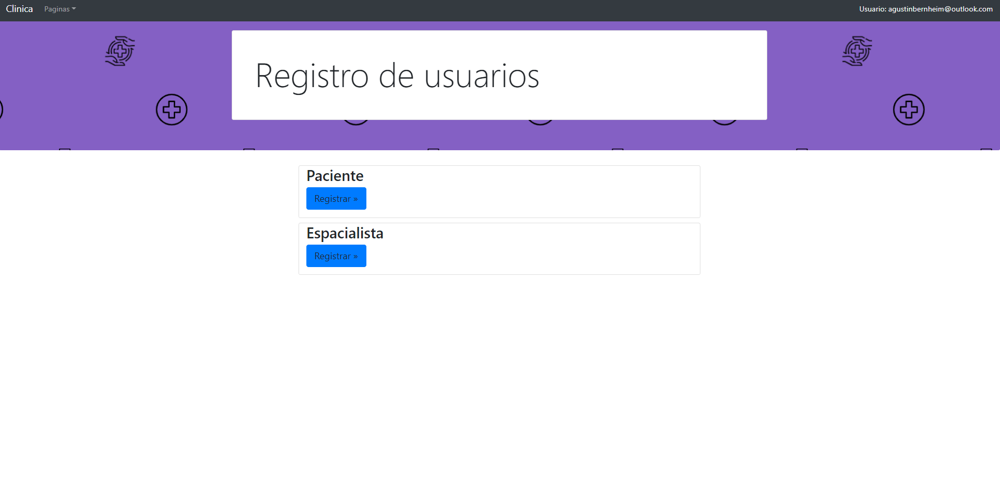
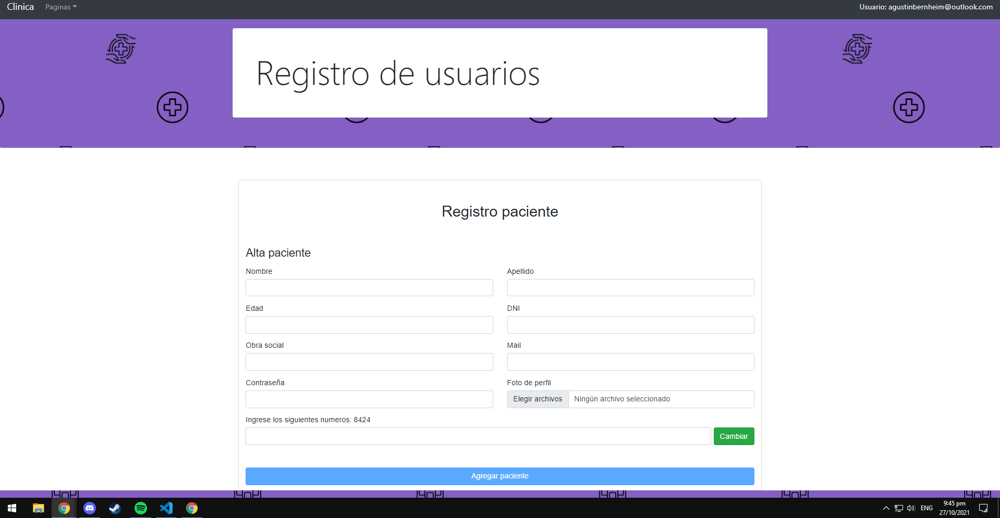
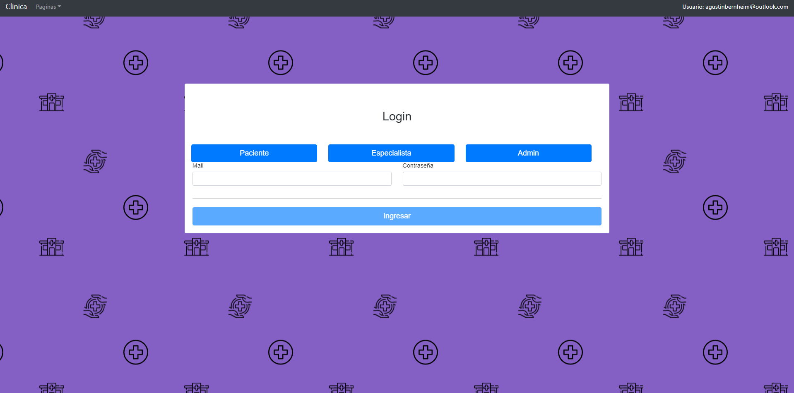
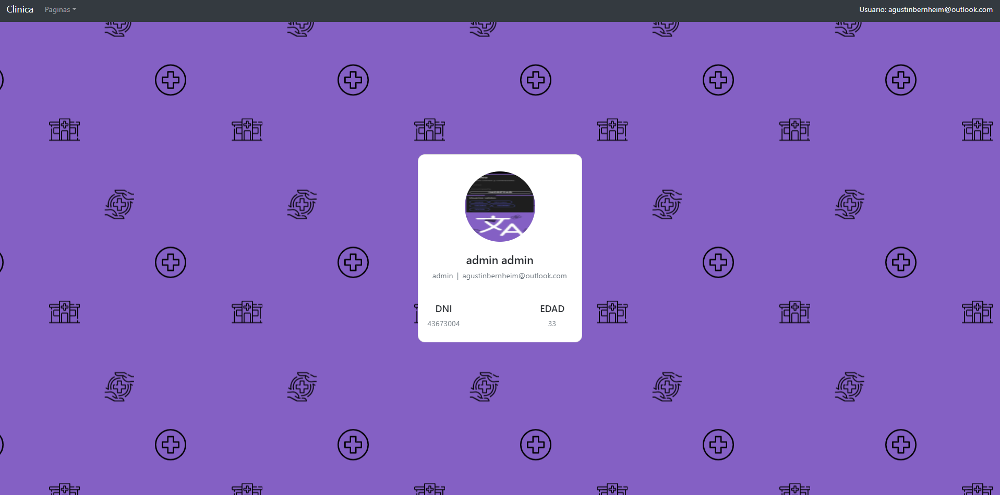
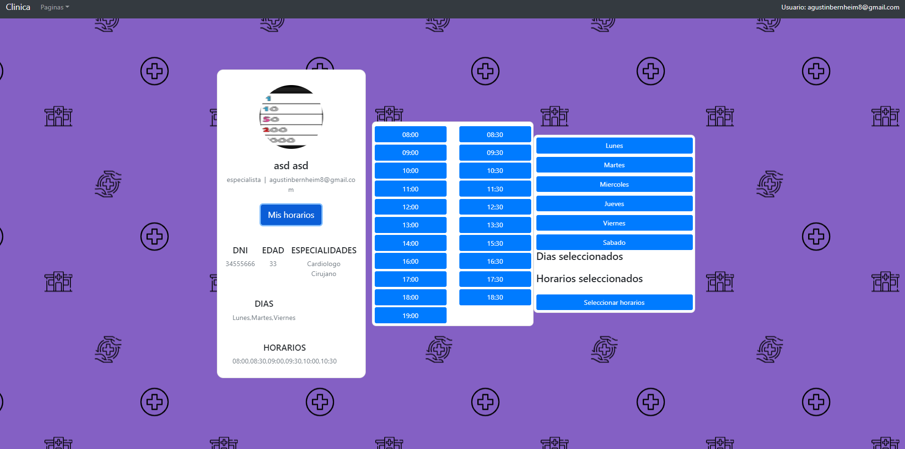
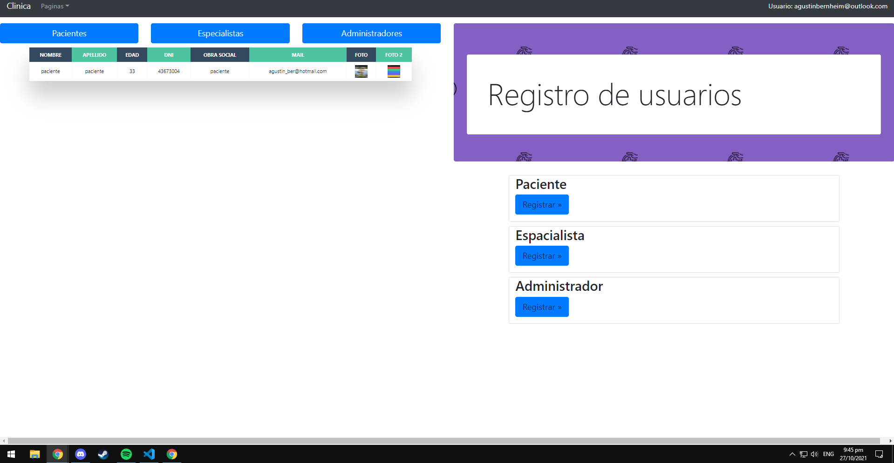
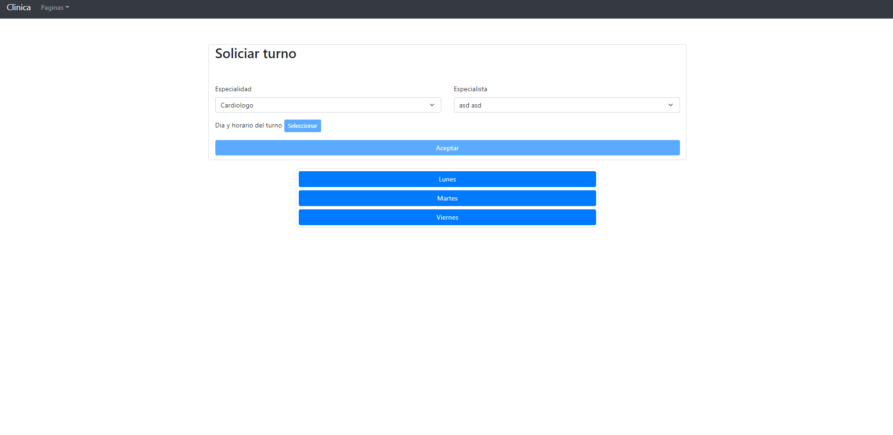

# Clinica Online 
## Agustin Bernheim

## Bienvenida

#### En esta seccion, el usuario puede ingresar al sistema, registrarse y luego de hacerlo, ver a las demas secciones que puede acceder

## Registro

#### Primero debe seleccionar que tipo de usuario quiere registrar, luego completar el formulario y el captcha para poder registrarlo

## Login

#### Esta seccion cuenta con tres accesos rapidos para los tipos de usuario, valida que el usuario haya verificado su email, y haya sido aprobado por un administrador en caso de ser especialista

## Perfil

#### Puede verse la foto del usuario y todos sus datos, en caso de ser especialista, puede seleccionar dias y horarios en los que atiende

## Seccion usuarios

#### Seccion exclusiva para usuarios administradores, a la izquierda cuenta con una lista de los usuarios registrados y a la derecha tiene la posibilidad de registrar nuevos usuarios

## Solicitar turno

#### En esta pagina, el paciente puede soliciar un turno que este disponible con el especialista que desee

